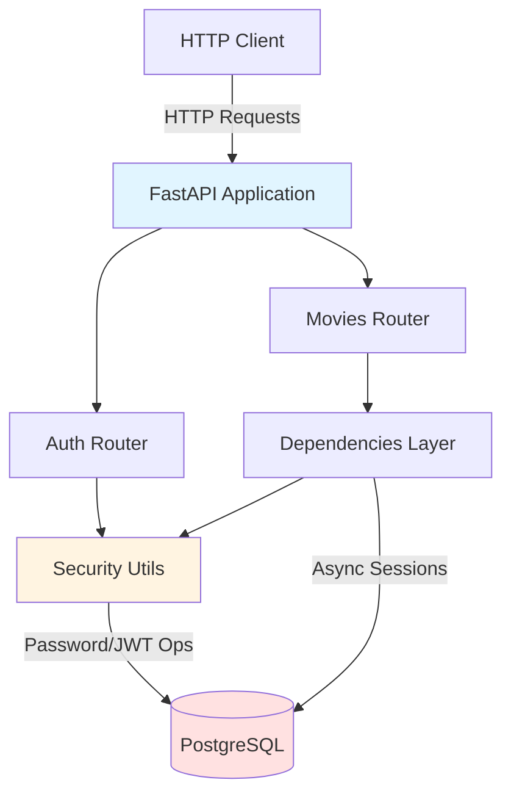
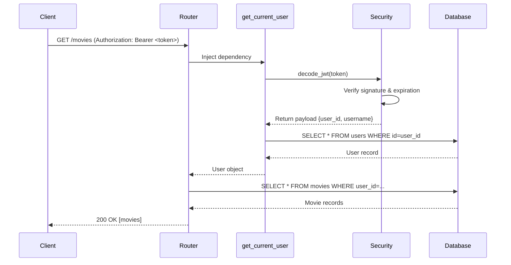
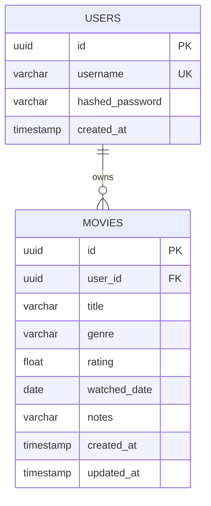

# Design Document: Movie Tracking API

## Overview

The movie tracking API is a FastAPI-based REST service enabling individual users to manage private collections of watched movies. The system provides JWT-based authentication and complete CRUD operations for movie entries with strict user data isolation.

### Core Capabilities

- **User Management**: Registration and login with bcrypt-hashed passwords
- **Authentication**: Stateless JWT token generation and validation
- **Movie CRUD**: Create, read, update, delete operations on user-owned movie records
- **Query Features**: Filter by genre, sort by title or watched date
- **Data Isolation**: Every movie operation scoped to authenticated user via JWT payload

### Technical Foundation

- **Framework**: FastAPI with async request handlers for high concurrency
- **Database**: PostgreSQL accessed via async SQLAlchemy 2.0 with asyncpg driver
- **Schema Management**: Alembic migrations for version-controlled database evolution
- **Validation**: Pydantic v2 for request/response serialization and type safety
- **Security**: JWT tokens (python-jose) with bcrypt password hashing (passlib)
- **Testing**: pytest with httpx AsyncClient for integration tests

### Design Principles

1. **Async-First**: All database operations use async sessions to avoid blocking
2. **Dependency Injection**: Reusable FastAPI dependencies for database sessions and authentication
3. **Thin Controllers**: Route handlers delegate logic to dependencies and security utilities
4. **Explicit Validation**: HTTPException with 422 status for consistent error responses
5. **Zero Trust**: User ID extracted only from validated JWT tokens, never from request data

## Architecture

### System Architecture



### Request Flow: Protected Endpoint



### Layer Responsibilities

**1. Routers Layer** (`app/routers/`)
- Define HTTP endpoints and path parameters
- Call dependencies for authentication and database sessions
- Delegate business logic to security utilities
- Return Pydantic response models

**2. Dependencies Layer** (`app/dependencies.py`)
- `get_db()`: Provide async database session per request
- `get_current_user()`: Extract and validate JWT, return authenticated User object

**3. Security Layer** (`app/core/security.py`)
- `hash_password()`: Generate bcrypt hashes
- `verify_password()`: Compare plain text with hash
- `create_access_token()`: Generate JWT with user_id/username payload
- `decode_access_token()`: Validate JWT and extract payload

**4. Models Layer** (`app/models/`)
- SQLAlchemy ORM models defining database schema
- Relationships and foreign key constraints

**5. Schemas Layer** (`app/schemas/`)
- Pydantic models for request validation and response serialization
- Field validators for length, format, and range constraints

## Components and Interfaces

### Database Connection Management

**Component**: `app/database.py`

```python
from sqlalchemy.ext.asyncio import create_async_engine, async_sessionmaker, AsyncSession
from sqlalchemy.orm import declarative_base

engine = create_async_engine(
    settings.DATABASE_URL,
    echo=False,
    pool_pre_ping=True,  # Verify connections before using
    pool_size=2,
    max_overflow=3
)

AsyncSessionLocal = async_sessionmaker(
    engine,
    class_=AsyncSession,
    expire_on_commit=False
)

Base = declarative_base()
```

**Key Decisions**:
- `pool_pre_ping=True` prevents stale connection errors
- `expire_on_commit=False` allows accessing attributes after commit without refetching
- Async engine requires `postgresql+asyncpg://` URL scheme

### Dependency Injection

**Component**: `app/dependencies.py`

**Database Session Dependency**:
```python
async def get_db() -> AsyncGenerator[AsyncSession, None]:
    async with AsyncSessionLocal() as session:
        try:
            yield session
            await session.commit()
        except Exception:
            await session.rollback()
            raise
```

**Authentication Dependency**:
```python
async def get_current_user(
    token: str = Depends(oauth2_scheme),
    db: AsyncSession = Depends(get_db)
) -> User:
    # Extract token from "Bearer <token>" header
    # Decode JWT and extract user_id
    # Query database for user record
    # Raise HTTPException(401) if any step fails
    # Return User object
```

**Usage Pattern**:
```python
@router.get("/movies")
async def list_movies(
    current_user: User = Depends(get_current_user),
    db: AsyncSession = Depends(get_db)
):
    # current_user is already authenticated
    # db is an active async session
```

### Authentication Flow

**Registration** (`POST /auth/register`):
1. Validate username (3-50 chars) and password (8+ chars) via Pydantic
2. Check username uniqueness (case-insensitive query)
3. Hash password with bcrypt
4. Insert user record with UUID primary key
5. Return 201 with UserResponse (id, username, created_at)

**Login** (`POST /auth/login`):
1. Accept JSON body with username and password
2. Query user by username (case-insensitive)
3. Verify password against stored hash
4. Generate JWT with payload: `{user_id: UUID, username: str, exp: timestamp}`
5. Return 200 with `{access_token: str, token_type: "bearer"}`

**Token Validation** (every protected endpoint):
1. Extract token from `Authorization: Bearer <token>` header
2. Decode JWT using JWT_SECRET
3. Verify signature and check expiration
4. Extract user_id from payload
5. Query database for user record
6. Return User object to route handler

### Movie CRUD Operations

**Create** (`POST /movies`):
- Input: `MovieCreate` schema with title (required), genre, rating, watched_date, notes (all optional)
- Validation: Title max 200 chars, genre max 100, rating 1.0-10.0, notes max 1000
- Process: Set user_id from JWT payload, insert record with UUID, set both created_at and updated_at to current UTC time (equal at creation)
- Output: 201 with `MovieResponse` including all fields plus created_at/updated_at

**List** (`GET /movies`):
- Query params: `genre` (filter), `sort_by` (title|watched_date), `order` (asc|desc)
- Process: Filter by user_id AND optional genre (case-insensitive ILIKE), apply sort
- Output: 200 with JSON array of `MovieResponse` objects (empty array if none)

**Retrieve** (`GET /movies/{movie_id}`):
- Path param: movie_id (UUID, automatically validated by FastAPI)
- Process: Query by id AND user_id, return 404 if not found or belongs to different user
- Output: 200 with single `MovieResponse`

**Update** (`PATCH /movies/{movie_id}`):
- Input: `MovieUpdate` schema with all fields optional
- Validation: Same constraints as create, return 422 if no fields provided
- Process: Query by id AND user_id, update provided fields, set updated_at to current UTC
- Output: 200 with updated `MovieResponse`

**Delete** (`DELETE /movies/{movie_id}`):
- Path param: movie_id (UUID, automatically validated by FastAPI)
- Process: Query by id AND user_id, delete if exists
- Output: 204 with no body (404 if not found or wrong user)

### Error Handling Strategy

**Authentication Errors** (always 401):
- Missing Authorization header: `{"detail": "Not authenticated"}`
- Invalid token format: `{"detail": "Invalid authentication credentials"}`
- Invalid signature: `{"detail": "Invalid authentication credentials"}`
- Expired token: `{"detail": "Token has expired"}`

**Validation Errors** (422):
- All validation errors use `{"detail": "<specific message>"}` format
- Raised as `HTTPException(status_code=422, detail="...")` not Pydantic errors
- Examples: "Title is required", "Rating must be between 1.0 and 10.0"

**Not Found Errors** (404):
- Movie not found or belongs to different user: `{"detail": "Movie not found"}`
- Same response for both cases to avoid leaking existence information

**Server Errors** (500):
- Database connection failures: `{"detail": "Internal server error"}`
- Unexpected exceptions caught by FastAPI's default handler

## Data Models

### Database Schema

**users table**:
```sql
CREATE TABLE users (
    id UUID PRIMARY KEY,
    username VARCHAR(50) NOT NULL,
    hashed_password VARCHAR(255) NOT NULL,
    created_at TIMESTAMP WITH TIME ZONE NOT NULL,
    CONSTRAINT unique_username_ci UNIQUE (LOWER(username))
);
```

**movies table**:
```sql
CREATE TABLE movies (
    id UUID PRIMARY KEY,
    user_id UUID NOT NULL REFERENCES users(id) ON DELETE CASCADE,
    title VARCHAR(200) NOT NULL,
    genre VARCHAR(100),
    rating FLOAT CHECK (rating >= 1.0 AND rating <= 10.0),
    watched_date DATE,
    notes VARCHAR(1000),
    created_at TIMESTAMP WITH TIME ZONE NOT NULL,
    updated_at TIMESTAMP WITH TIME ZONE NOT NULL,
    INDEX idx_movies_user_id (user_id)
);
```

**Key Constraints**:
- UUID primary keys for all tables
- Foreign key `movies.user_id → users.id` with CASCADE delete
- Case-insensitive username uniqueness via functional index
- Check constraint on rating column (database-level enforcement)

### SQLAlchemy Models

**User Model** (`app/models/user.py`):
```python
from sqlalchemy import Column, String, DateTime, Index
from sqlalchemy.dialects.postgresql import UUID
from sqlalchemy.orm import relationship
from sqlalchemy.sql import func
import uuid
from datetime import datetime, timezone

class User(Base):
    __tablename__ = "users"
    
    id = Column(UUID(as_uuid=True), primary_key=True, default=uuid.uuid4)
    username = Column(String(50), nullable=False, index=True)
    hashed_password = Column(String(255), nullable=False)
    created_at = Column(DateTime(timezone=True), nullable=False, 
                       default=lambda: datetime.now(timezone.utc))
    
    movies = relationship("Movie", back_populates="owner", cascade="all, delete-orphan")
    
    __table_args__ = (
        Index('ix_users_username_lower', func.lower(username), unique=True),
    )
```

**Movie Model** (`app/models/movie.py`):
```python
from sqlalchemy import Column, String, Float, Date, DateTime, ForeignKey, CheckConstraint
from sqlalchemy.dialects.postgresql import UUID
from sqlalchemy.orm import relationship
import uuid
from datetime import datetime, timezone

class Movie(Base):
    __tablename__ = "movies"
    
    id = Column(UUID(as_uuid=True), primary_key=True, default=uuid.uuid4)
    user_id = Column(UUID(as_uuid=True), ForeignKey("users.id", ondelete="CASCADE"), 
                    nullable=False, index=True)
    title = Column(String(200), nullable=False)
    genre = Column(String(100), nullable=True)
    rating = Column(Float, nullable=True)
    watched_date = Column(Date, nullable=True)
    notes = Column(String(1000), nullable=True)
    created_at = Column(DateTime(timezone=True), nullable=False,
                       default=lambda: datetime.now(timezone.utc))
    updated_at = Column(DateTime(timezone=True), nullable=False,
                       default=lambda: datetime.now(timezone.utc),
                       onupdate=lambda: datetime.now(timezone.utc))
    
    owner = relationship("User", back_populates="movies")
    
    __table_args__ = (
        CheckConstraint('rating >= 1.0 AND rating <= 10.0', name='check_rating_range'),
    )
```

### Pydantic Schemas

**User Schemas** (`app/schemas/user.py`):
```python
from pydantic import BaseModel, Field, ConfigDict
from uuid import UUID
from datetime import datetime

class UserCreate(BaseModel):
    username: str = Field(..., min_length=3, max_length=50)
    password: str = Field(..., min_length=8)

class UserResponse(BaseModel):
    model_config = ConfigDict(from_attributes=True)
    
    id: UUID
    username: str
    created_at: datetime

class Token(BaseModel):
    access_token: str
    token_type: str
```

**Movie Schemas** (`app/schemas/movie.py`):
```python
from pydantic import BaseModel, Field, ConfigDict
from uuid import UUID
from datetime import datetime, date
from typing import Optional

class MovieCreate(BaseModel):
    # Empty/whitespace title validation is handled in the route handler via
    # HTTPException(status_code=422, detail="Title is required") to ensure
    # all 422 responses return {"detail": "..."} format instead of Pydantic's list format
    title: str = Field(..., max_length=200)
    genre: Optional[str] = Field(None, max_length=100)
    rating: Optional[float] = Field(None, ge=1.0, le=10.0)
    watched_date: Optional[date] = None
    notes: Optional[str] = Field(None, max_length=1000)

class MovieUpdate(BaseModel):
    model_config = ConfigDict(from_attributes=True, extra='ignore')
    
    title: Optional[str] = Field(None, max_length=200)
    genre: Optional[str] = Field(None, max_length=100)
    rating: Optional[float] = Field(None, ge=1.0, le=10.0)
    watched_date: Optional[date] = None
    notes: Optional[str] = Field(None, max_length=1000)

class MovieResponse(BaseModel):
    model_config = ConfigDict(from_attributes=True)
    
    id: UUID
    user_id: UUID
    title: str
    genre: Optional[str]
    rating: Optional[float]
    watched_date: Optional[date]
    notes: Optional[str]
    created_at: datetime
    updated_at: datetime
```

### Entity Relationships



**Relationship Rules**:
- One user owns zero or many movies (1:N)
- One movie belongs to exactly one user
- Deleting a user cascades to all their movies
- No movie can exist without a valid user_id

## Correctness Properties

*A property is a characteristic or behavior that should hold true across all valid executions of a system—essentially, a formal statement about what the system should do. Properties serve as the bridge between human-readable specifications and machine-verifiable correctness guarantees.*

### Correctness Properties

### Property 1: Registration creates user with hashed password

*For any* valid username (3-50 chars) and password (8+ chars), registration SHALL:
- Store a user record with username and bcrypt-hashed password
- Return HTTP 201 with response containing id (UUID), username, and created_at (ISO 8601)
- Never store the plain text password in the database

**Validates: Requirements 1.1, 1.2, 1.3, 12.1, 12.2**

### Property 2: Username uniqueness is enforced case-insensitively

*For any* registered username and any case variation of that username, attempting to register with the case-varied username SHALL:
- Return HTTP 422 with `{"detail": "Username already exists"}`
- Not create a new user record

**Validates: Requirements 1.4**

### Property 3: Login with valid credentials returns valid JWT

*For any* registered user with valid credentials, logging in with exact or case-varied username SHALL:
- Return HTTP 200 with `{access_token: str, token_type: "bearer"}`
- Generate a JWT token that decodes to reveal correct user_id and username in payload
- Set token expiration based on TOKEN_EXPIRY_MINUTES configuration

**Validates: Requirements 2.1, 2.2, 2.3, 2.4**

### Property 4: Login with invalid credentials returns consistent error

*For any* login attempt with non-existent username OR registered username with wrong password, the system SHALL:
- Return HTTP 401 with `{"detail": "Invalid username or password"}`
- Return identical error message for both failure cases

**Validates: Requirements 2.5, 2.6, 12.5**

### Property 5: Token validation failures return appropriate errors

*For any* protected endpoint request with missing, malformed, invalid, or expired JWT token, the system SHALL:
- Return HTTP 401 with appropriate error message
- Reject the request before executing any business logic
- Never leak information about whether specific resources exist

**Validates: Requirements 3.2, 3.3, 3.4, 3.5, 3.6**

### Property 6: Movie creation stores with JWT user_id

*For any* authenticated user and valid movie data (title + optional fields), creating a movie SHALL:
- Store the movie with user_id extracted from JWT payload, ignoring any user_id in request body
- Return HTTP 201 with complete movie data including id, user_id, all provided fields, and timestamps
- Set created_at and updated_at to the same value at creation time

**Validates: Requirements 4.1, 4.2, 4.8, 13.2, 13.4, 13.5**

### Property 7: Movie listing returns only authenticated user's movies

*For any* authenticated user, listing movies SHALL:
- Return HTTP 200 with JSON array containing only movies where user_id matches the authenticated user
- Return empty array when user has no movies
- Never include movies belonging to other users, regardless of query parameters

**Validates: Requirements 5.1, 5.10, 13.1**

### Property 8: Genre filter matches case-insensitively

*For any* authenticated user with movies of various genres, filtering by genre parameter SHALL:
- Return only movies where genre field matches the filter value using case-insensitive comparison
- Return empty array when no movies match the filter
- Match "action" with "Action", "ACTION", "aCtiOn", etc.

**Validates: Requirements 5.2**

### Property 9: Movie sorting produces correct order

*For any* authenticated user with multiple movies, applying sort_by parameter SHALL:
- Sort by title in lexicographical order when sort_by="title"
- Sort by watched_date in chronological order (null values last) when sort_by="watched_date"
- Reverse the order when order="desc"
- Default to ascending order when order parameter is omitted

**Validates: Requirements 5.3, 5.4, 5.5, 5.6**

### Property 10: Movie retrieval respects ownership

*For any* movie ID and authenticated user:
- IF the movie exists AND belongs to the authenticated user, SHALL return HTTP 200 with complete movie data
- IF the movie does not exist OR belongs to a different user, SHALL return HTTP 404 with `{"detail": "Movie not found"}`
- SHALL return identical 404 response for both non-existent and unauthorized access to prevent information leakage

**Validates: Requirements 6.1, 6.3, 6.4, 6.5, 6.6, 13.3**

### Property 11: Movie update modifies only provided fields

*For any* authenticated user's movie and partial update data (subset of fields), updating SHALL:
- Modify only the fields present in the update request
- Leave unspecified fields unchanged from their original values
- Update the updated_at timestamp to current UTC time
- Return HTTP 200 with complete updated movie data reflecting all changes

**Validates: Requirements 7.7, 7.12, 7.13**

### Property 12: Cross-user movie updates are rejected

*For any* movie belonging to user A, if user B (different authenticated user) attempts to update it, the system SHALL:
- Return HTTP 404 with `{"detail": "Movie not found"}`
- Not modify the movie record
- Not leak information about the movie's existence

**Validates: Requirements 7.3, 7.4, 7.5, 13.3, 13.7**

### Property 13: Movie deletion removes record

*For any* authenticated user's movie, deleting it SHALL:
- Remove the record from the database
- Return HTTP 204 with no response body
- Cause subsequent retrieval attempts to return HTTP 404

**Validates: Requirements 8.5, 8.6**

### Property 14: Cross-user movie deletions are rejected

*For any* movie belonging to user A, if user B (different authenticated user) attempts to delete it, the system SHALL:
- Return HTTP 404 with `{"detail": "Movie not found"}`
- Not delete the movie record
- Leave the movie accessible to user A

**Validates: Requirements 8.4, 8.7, 8.8, 13.3, 13.8**

### Property 15: Non-existent movie operations return 404

*For any* non-existent movie ID (random UUID not in database), operations (retrieve, update, delete) SHALL:
- Return HTTP 404 with `{"detail": "Movie not found"}`
- Not create side effects or leak information

**Validates: Requirements 6.5, 8.7**

### Property 16: Passwords are never stored or returned in plain text

*For any* user operation (registration, login, profile retrieval), the system SHALL:
- Never store plain text passwords in the database (only bcrypt hashes)
- Never return hashed_password in any API response body
- Store passwords in bcrypt format with valid salt and hash

**Validates: Requirements 12.1, 12.2, 12.3**

### Property 17: Sensitive data is never exposed in responses

*For any* API response from any endpoint, the response body SHALL:
- Never contain JWT_SECRET configuration value
- Never contain hashed_password field
- Never contain any other sensitive configuration or credential data

**Validates: Requirements 11.5, 12.3**

### Property 18: User ID is always extracted from JWT payload

*For any* movie operation with user_id provided in request body or query parameters, the system SHALL:
- Ignore the provided user_id completely
- Use only the user_id extracted from the validated JWT token payload
- Apply all authorization checks using the JWT user_id

**Validates: Requirements 3.8, 13.4, 13.5**

### Property 19: Complete user data isolation across all operations

*For any* two distinct users A and B:
- User A can list, retrieve, update, and delete only their own movies
- User B can list, retrieve, update, and delete only their own movies
- User A's movie IDs, even if known to user B, return 404 when accessed by user B
- No movie operation by one user can access or modify another user's data

**Validates: Requirements 13.1, 13.3, 13.6, 13.7, 13.8**

## Error Handling

### Error Categories and Responses

**Authentication Errors (401 Unauthorized)**:
- Missing Authorization header: `{"detail": "Not authenticated"}`
- Malformed header (not "Bearer <token>"): `{"detail": "Invalid authentication credentials"}`
- Invalid token signature: `{"detail": "Invalid authentication credentials"}`
- Expired token: `{"detail": "Token has expired"}`
- User not found after token decode: `{"detail": "Invalid authentication credentials"}`

**Validation Errors (422 Unprocessable Entity)**:
All validation errors return `{"detail": "<specific message>"}`:
- Username too short/long: "Username must be between 3 and 50 characters"
- Password too short: "Password must be at least 8 characters"
- Username exists: "Username already exists"
- Title missing: "Title is required"
- Title too long: "Title must not exceed 200 characters"
- Genre too long: "Genre must not exceed 100 characters"
- Rating out of range: "Rating must be between 1.0 and 10.0"
- Notes too long: "Notes must not exceed 1000 characters"
- Invalid date format: "Invalid date format. Use YYYY-MM-DD"
- Invalid sort_by: "Invalid sort_by value. Must be 'title' or 'watched_date'"
- Invalid order: "Invalid order value. Must be 'asc' or 'desc'"
- Empty update: "No fields to update"

**Not Found Errors (404 Not Found)**:
- Movie not found or unauthorized: `{"detail": "Movie not found"}`
  - Same response for non-existent and unauthorized to prevent information leakage

**Server Errors (500 Internal Server Error)**:
- Database connection failure: `{"detail": "Internal server error"}`
- Unexpected exceptions: Handled by FastAPI default exception handler

### Error Handling Implementation

**Custom Exception Handler**:
```python
# app/main.py
from fastapi import FastAPI, Request
from fastapi.responses import JSONResponse

@app.exception_handler(Exception)
async def global_exception_handler(request: Request, exc: Exception):
    # Log the error for debugging
    logger.error(f"Unhandled exception: {exc}", exc_info=True)
    return JSONResponse(
        status_code=500,
        content={"detail": "Internal server error"}
    )
```

**Validation Error Strategy**:
- Use `HTTPException(status_code=422, detail="message")` for consistent error format
- Avoid relying on Pydantic's default ValidationError format (list of errors)
- Implement custom validators in Pydantic schemas when needed
- Raise HTTPException in route handlers for business logic validation

**Database Error Handling**:
```python
try:
    await session.execute(query)
    await session.commit()
except SQLAlchemyError as e:
    await session.rollback()
    logger.error(f"Database error: {e}")
    raise HTTPException(status_code=500, detail="Internal server error")
```

**Authentication Error Precedence**:
1. Check Authorization header presence → 401 "Not authenticated"
2. Check header format → 401 "Invalid authentication credentials"
3. Decode and verify JWT → 401 "Invalid authentication credentials" or "Token has expired"
4. Query user from database → 401 "Invalid authentication credentials"
5. Proceed with authorized operation

### Logging Strategy

Use Python's standard `logging` module. Log unhandled exceptions at ERROR level in the global exception handler only. Never log plain text passwords or JWT tokens.

## Testing Strategy

### Testing Approach

The system uses **lean integration tests** with pytest and httpx AsyncClient. Tests cover exactly the acceptance criteria defined in Requirement 14.

### Test Database Setup

**Configuration**:
- Use PostgreSQL test database isolated from development/production
- Add TEST_DATABASE_URL to Settings class and .env.example
- Reset schema between test runs

**Test Fixtures** (`conftest.py`):
```python
import pytest
from sqlalchemy.ext.asyncio import create_async_engine, async_sessionmaker
from httpx import ASGITransport, AsyncClient
from app.main import app
from app.database import Base, get_db
from app.core.config import settings

@pytest.fixture(scope="session")
async def test_engine():
    """Create test database engine once per session"""
    engine = create_async_engine(settings.TEST_DATABASE_URL)
    async with engine.begin() as conn:
        await conn.run_sync(Base.metadata.drop_all)
        await conn.run_sync(Base.metadata.create_all)
    yield engine
    await engine.dispose()

@pytest.fixture
async def test_session(test_engine):
    """Provide test session with rollback after each test"""
    async_session = async_sessionmaker(test_engine, expire_on_commit=False)
    async with async_session() as session:
        yield session
        await session.rollback()

@pytest.fixture
async def client(test_session):
    """Provide test client with overridden database dependency"""
    def override_get_db():
        yield test_session
    
    app.dependency_overrides[get_db] = override_get_db
    transport = ASGITransport(app=app)
    async with AsyncClient(transport=transport, base_url="http://test") as ac:
        yield ac
    app.dependency_overrides.clear()
```

### Test Coverage Requirements

Tests must verify the acceptance criteria from Requirement 14:

**Required Test Cases**:
1. Successful user registration returns HTTP 201 with id, username, created_at
2. Successful login returns HTTP 200 with access_token and token_type
3. Login with incorrect credentials returns HTTP 401 (parametrised test for wrong password and non-existent username)
4. Creating a movie with valid JWT returns HTTP 201 with all movie fields
5. Listing movies with valid JWT returns HTTP 200 with only authenticated user's movies
6. Listing movies returns empty array when user has no movies
7. Fetching another user's movie returns HTTP 404
8. Updating another user's movie returns HTTP 404
9. Deleting a movie with valid JWT returns HTTP 204
10. Protected endpoint without JWT returns HTTP 401
11. Creating a movie without title returns HTTP 422

### Example Test Structure

**Authentication Test**:
```python
async def test_register_success(client):
    response = await client.post(
        "/auth/register",
        json={"username": "testuser", "password": "password123"}
    )
    assert response.status_code == 201
    data = response.json()
    assert "id" in data
    assert data["username"] == "testuser"
    assert "created_at" in data
```

**Parametrised Login Failure Test**:
```python
@pytest.mark.parametrize("username,password", [
    ("testuser", "wrongpassword"),  # Wrong password
    ("nonexistent", "password123"),  # Non-existent username
])
async def test_login_invalid_credentials(client, username, password):
    # First register a test user
    await client.post(
        "/auth/register",
        json={"username": "testuser", "password": "password123"}
    )
    
    # Attempt login with invalid credentials
    response = await client.post(
        "/auth/login",
        json={"username": username, "password": password}
    )
    assert response.status_code == 401
    assert response.json() == {"detail": "Invalid username or password"}
```

**Cross-User Isolation Test**:
```python
async def test_fetch_another_users_movie_returns_404(client):
    # Register two users
    user1_token = await register_and_login(client, "user1", "password1")
    user2_token = await register_and_login(client, "user2", "password2")
    
    # User1 creates a movie
    response = await client.post(
        "/movies",
        json={"title": "User1 Movie"},
        headers={"Authorization": f"Bearer {user1_token}"}
    )
    movie_id = response.json()["id"]
    
    # User2 attempts to fetch User1's movie
    response = await client.get(
        f"/movies/{movie_id}",
        headers={"Authorization": f"Bearer {user2_token}"}
    )
    assert response.status_code == 404
    assert response.json() == {"detail": "Movie not found"}
```

### Test Execution

**Run all tests**:
```bash
pytest tests/ -v
```

**Run with coverage**:
```bash
pytest tests/ --cov=app --cov-report=html
```
